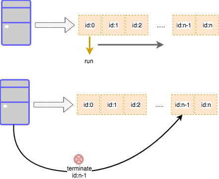
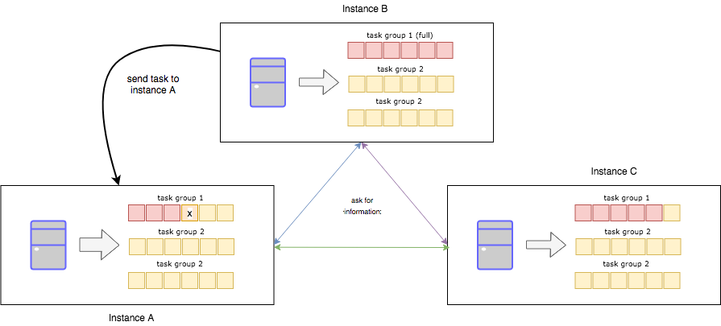

# GoBucket

Gobucket is an easy process background job for Go project. Gobucket keeps the job process in memory, and run it right away, or wait until a certain time has been met. 

## A. Standalone

For standalone purpose, gobucket works as go routine callback framework and queue holder. It simply push the your task into the stack and run it as a go routine right away, according to the configuration.
The gobucket, will run the event inside the task definition stubs and function, and will act according to the operation. result.

 

As it has been shown on image. It also possible to kill/remove the scheduled task. This can be used for several use case. For instance, the gobucket is used as a backup plan when a pub-sub is being delayed. 
But when it is consumed successfully, the process is invalid, then  we can just kill the process scheduled inside the queue.

### Usage:

```
taskBucket := gobucket.NewTaskBucket(&gobucket.BucketConfig{
		LifeSpan:  time.Second * 5,
		MaxBucket: 1024,
		Verbose:   true,
        	RunAfter:  time.Second
}, new(sampleExecutor))
```

This is the simple implementation for creating a `taskBucket` the task bucket will holds the job inside the memory as a map of task with a id (string) as an identifier. 

`sampleExecutor` represent an executor, a core of single task job:

```

func (se *sampleExecutor) OnExecute(ctx context.Context, id string, data interface{}) error {
	log.Println("ON EXECUTE:", id, "data=", data)
	return nil
}

func (se *sampleExecutor) OnFinish(ctx context.Context, id string, data interface{}) error {
	return nil
}

func (se *sampleExecutor) OnTaskExhausted(ctx context.Context, id string, data interface{}) error {
	//log.Println("on timeout: process id=", id)
	return nil
}

func (se *sampleExecutor) OnExecuteError(ctx context.Context, id string, data interface{}, onExecuteErr error) error {
	//log.Println("on execute error: process id=", id, "previous err=", onExecuteErr.Error())
	return nil
}

func (se *sampleExecutor) OnPanic(ctx context.Context, id string, data interface{}) error {
	log.Println("on panic: process id=", id)
	return nil
}
```

The task inside the bucket will be executed right away, so it is expected to not depend for each other. Each task will have its own life-span which will be removed by itself when it happens. This is the simple way to add the task to the bucket:

```
data := struct {
	ID   int    `json:"id"`
	Name string `json:"name"`
}{
    	ID:   1,
	Name: "Johnson",
}
taskBucket.Fill(context.Background(), gobucket.ImmidiateTask, fmt.Sprintf("process::%d", proc), data)
```

At the moment, there is 2 type of task type:
1. Immidiate task: This is represented by `gobucket.ImmidiateTask`. This task will be executed right away, after being scheduled.
2. Time bomb task: This is represented by `gobucket.TimeBombTask`. This task will wait until the expected time before being executed using config `RunAfter`. Please be notified that the `LifeSpan` should be `>` than `RunAfter` so it can work without any problem.

To remove the task from the bucket, it can use
```
taskBucket.Drain(context.Background(), id)
```
Drain should be call when the task is not yet exists. It will trigger `signal quit` and remove the task.

### Error Recovery

The executor support event where panic occur. For instance, when panic occur, you need to store the task somewher (i.e: redis as a task pool or pub-sub) to be done later. In that case, it need to rescue all task before the signal is terminated after panic

```
func RecoverPanic(tb gobucket.TaskBucket) {
	if r := recover(); r != nil {
		tb.Rescue(context.Background())
	}
}

func ....(){
	taskBuffer := gobuckert.NewTaskBuff...
	//here where panic occur, i.e: handler, etc
	defer RecoverPanic(taskBuffer)
	//panic happen
}
```

The `Rescue` will send the signal to each alive task and run the `executor.OnPanic(ctx, id, data)` function.

## B. Shared Task Bucket

For example our app runs on multiple instance. It means each instance has the same task bucket(s) definition. By using shared task bucket we can communicate our task to another instance which has larger 
task buffer availability. This is very essential to keep the performance and avoid the dropping task when the buffer is full.



### Usage:

```$xslt
tb := gobucket.NewTaskBucket(&gobucket.BucketConfig{
		LifeSpan:  time.Second * 2,
		MaxBucket: 1024,
		Verbose:   true,
		RunAfter:  time.Second,
    }, new(sampleExecutor))

group := make(map[string]gobucket.TaskBucket, 0)
group["sample"] = tb
peers := []string{
	"10.0.0.1:6666",
	"10.0.0.2:6666",
	"10.0.0.3:6666",
}

bg := gobucket.NewTaskBucketGroup(group, peers, *port, *debug)

log.Println("start serving..")
bg.StartWork()
```

In this implementation, we can define more than task bucket, as each instance may have multiple task bucket running. Then, it is also a mandatory, to list all peers 
(other app's running instance) which also deploy this implementation.

To fill the task using shared bucket, we can use this function directly.

```$xslt
err := bg.Fill(ctx, id, "sample", data)
```

This function will assign the go routine task to local buffer first. If the task buffer is full, then it will uses the information from other peers 
about their buffer availability. The peer with least buffer availability will be assigned to the task. 

**WARNING**
It is possible to have the task assigned, but the peer reject it because it is full. TODO: create a callback to notify the failure

here, **sample** is the name of task group which we defined previously, the data should be in the same conversion for sample task definition. 

### Development:

Gobucket is expected to be a lightweight library for its implementation. However, this library is under development and require test to be used in production. If you are interested in more mature library which store the job in db such as redis, you can find alot of background process job support go-library in github.
